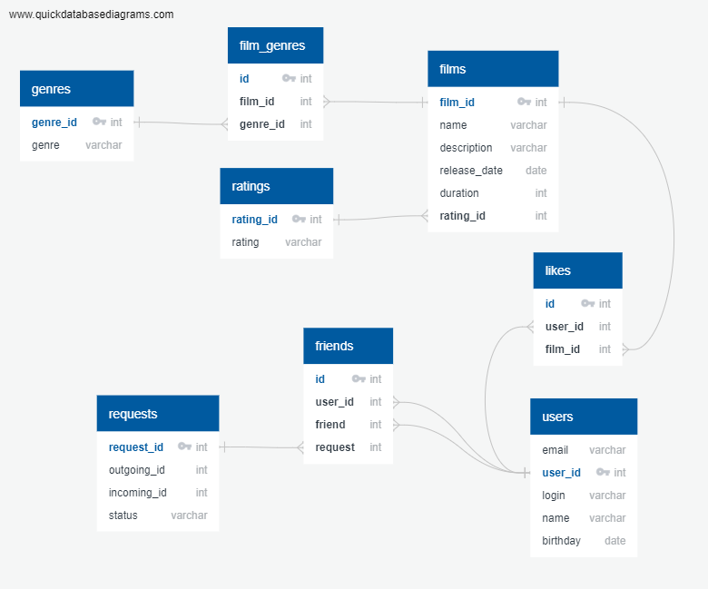

# java-filmorate

Данный проект является работой над проектами 8-11 спринтов на курсе Java-разработчик в Яндекс.Практикум.

В результате работы реализован бэк-энд RESTAPI приложения для подбора и оценки фильмов.

Возможности:

- создание, обновление фильмов.
- возможность отметки понравившихся фильмов.
- выведение ТОПа фильмов по количеству положительных оценок.
- создание и обновление пользователей
- добавление пользователей в друзья. Когда пользователеь добавляет вас в друзья, вы появляетесь в его списке друзей
автоматически. У вас появляется заявка на ответное добавление в друзья. Если вы её примете, то "дружба"
станет взаимной.
- удаление пользователей из друзей. При взаимной дружбе удаление одного пользователя из друзей ведёт к
обоюдному удалению из обоих списков.

При разработке использовался фреймворк Spring Boot и база данных H2.
Структура базы данных представлена на изображении.

Разработал Красногорский Михаил mikser256@yandex.ru
